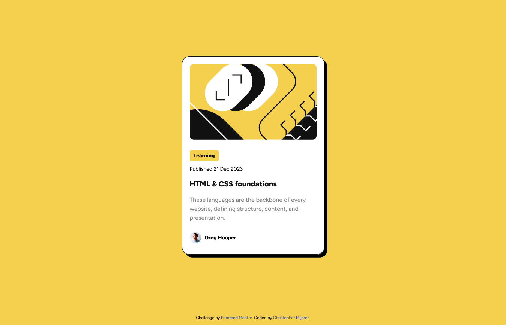

# Frontend Mentor - Blog preview card solution

This is a solution to the [Blog preview card challenge on Frontend Mentor](https://www.frontendmentor.io/challenges/blog-preview-card-ckPaj01IcS). Frontend Mentor challenges help you improve your coding skills by building realistic projects. 

## Table of contents

- [Overview](#overview)
  - [The challenge](#the-challenge)
  - [Screenshot](#screenshot)
  - [Links](#links)
- [My process](#my-process)
  - [Built with](#built-with)
  - [Useful resources](#useful-resources)
- [Author](#author)

## Overview

### The challenge

Users should be able to:

- See hover and focus states for all interactive elements on the page

### Screenshot

### Links

- Solution URL: [https://www.frontendmentor.io/solutions/blog-preview-card-using-bem-7lllYormh5](https://www.frontendmentor.io/solutions/blog-preview-card-using-bem-7lllYormh5)
- Live Site URL: [https://myblog-preview-card.netlify.app/](https://myblog-preview-card.netlify.app/)

## My process

### Built with

- Semantic HTML5 markup
- CSS custom properties
- Flexbox
- CSS BEM
- Mobile-first workflow

### Useful resources

- [Perfect Pixel](https://chromewebstore.google.com/detail/perfectpixel-by-welldonec/dkaagdgjmgdmbnecmcefdhjekcoceebi?hl=es) - Resource that allows me to compare the details of the design i have to the one i desire to get. So i can adjust font size, margin, padding, etc.
- [Mozilla Documentation](https://developer.mozilla.org/es/docs/Web/CSS/box-sizing) - This article helped me understand shadows a bit more. I'd recommend it to anyone still learning this concept.

## Author

- Frontend Mentor - [@cemijares23](https://www.frontendmentor.io/profile/cemijares23)
- Instagram - [@cmijares23](https://www.instagram.com/cmijares23)
